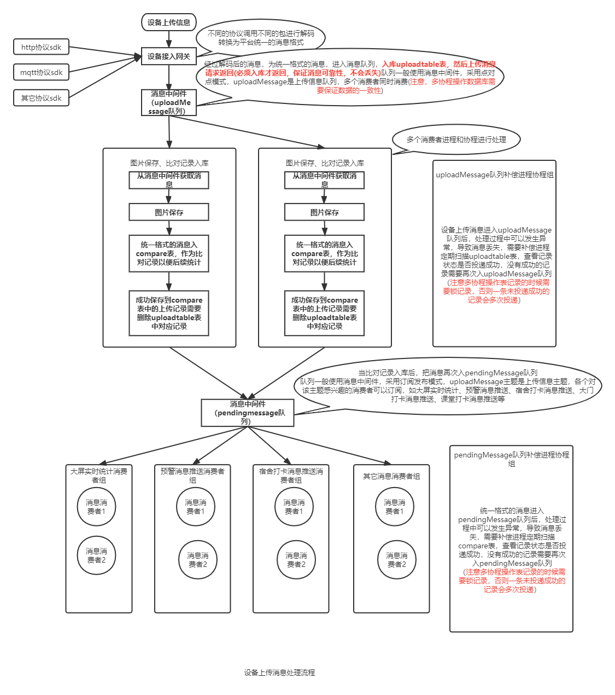
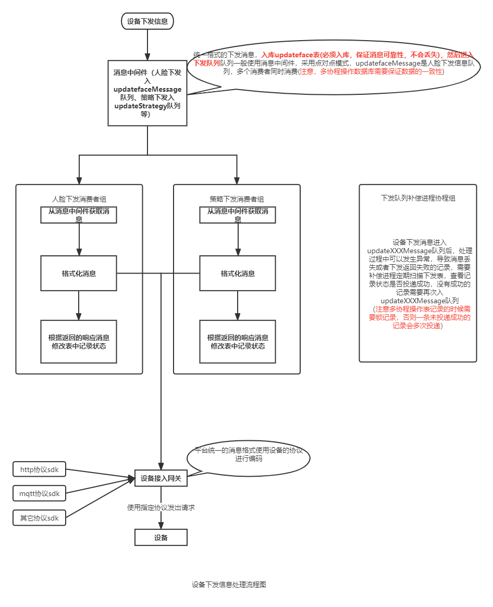

# 设备管理模块

## 简介

设备管理模块，主要负责和设备进行交互，包括设备上传和平台下发。同时包括后台对设备的管理，如对设备进行管理，协议进行管理。

### 统一设备管理

- 统一设备数据管理。
- 向上提供统一的设备操作API，屏蔽各个厂家不同协议不同设备的差异。
- 使用中间件异步的进行设备消息收发。

### 多协议适配 

不同设备使用不同协议接入集成了各种常见的网络协议MQTT、HTTP等，并对其进行封装，实现统一管理等功能。降低网络编程的复杂度。多消息协议支持，将自定义的消息解析为平台统一的消息格式。

### 对外统一接口

向外提供统一的消息接口，不同调用方式：

- 把当前模块作为依赖包集成到项目中，直接通过接口函数调用；
- 单独模块部署在服务器中，然后通过接口协议调用；

## 设计原理

- 设备上传信息处理流程

- 设备下发信息处理流程

## 技术选型

- PHP7.4
- Swoole4.8
- EasySwoole3.5
- 消息中间件使用redis(单机版本使用轻量级消息中间件，以后扩展为分布式部署的话，使用RabbitMQ、RocketMQ、Kafka等)
- Mysql5.7+
- Vue2/Layui

## 目录结构

~~~
device-manage-sdk         项目部署目录
├─src                     应用目录
│  ├─Common               通用常量和函数目录
│  ├─Exceptions           异常类目录
│  ├─Contracts            抽象接口类目录
│  ├─Utility              工具目录
│  ├─Gateway              网关目录，需要多协议适配
│  ├─Middleware           中间件目录，需要多中间件适配
│  ├─Device               设备后台管理目录
│  ├─Api                  设备管理模块向外提供接口目录，需要多种调用方式适配
│  ├─Model                数据库操作模型目录
├─Bin                     应用bin文件目录
│  ├─app.sh               应用shell脚本
│  ├─easyswoole.service   easyswoole开机启动配置文件
├─Runtime                 运行时目录
│  ├─Log                  日志保存目录
│  ├─Temp                 临时信息、缓存目录
├─UnitTest                单元测试目录
├─vendor                  第三方类库目录
├─.php-cs-fixer.dist.php  php-cs-fixer代码格式规范工具配置文件
├─composer.json           Composer配置文件
├─composer.lock           Composer锁定文件
├─bootstrap.php           预处理或者是预定义
├─EasySwooleEvent.php     框架全局事件
├─easyswoole              框架管理脚本
├─phpunit.php             单元测试入口文件
├─dev.php                 开发配置文件
├─produce.php             生产配置文件
~~~

## 表设计

### 设备上传信息表设计
~~~
DROP TABLE IF EXISTS `mymk_upload`;
CREATE TABLE `mymk_upload` (
   `id` bigint(20) unsigned NOT NULL AUTO_INCREMENT,
   `task_id` varchar(100) DEFAULT NULL COMMENT '消息id',
   `status` tinyint(1) DEFAULT 0 COMMENT '消息处理状态，0：待处理；1：正在处理，2：处理完成，3：处理失败',
   `createtime` int(10) unsigned DEFAULT 0,
   PRIMARY KEY (`id`),
   KEY `status_index` (`status`)
) ENGINE=InnoDB DEFAULT CHARSET=utf8mb4 COMMENT='设备上传信息主表';

DROP TABLE IF EXISTS `mymk_upload_info`;
CREATE TABLE `mymk_upload_info` (
   `id` bigint(20) unsigned NOT NULL,
   `raw_message` text COMMENT '原始消息',
   KEY `id_index` (`id`),
   CONSTRAINT `fk_upload_id` FOREIGN KEY (`id`) REFERENCES `mymk_upload` (`id`)
) ENGINE=InnoDB DEFAULT CHARSET=utf8mb4 COMMENT='设备上传信息副表';

DROP TABLE IF EXISTS `mymk_compare`;
CREATE TABLE `mymk_compare` (
    `id` bigint(20) unsigned NOT NULL AUTO_INCREMENT,
    `deviceid` varchar(32) NOT NULL,
    `deviceremark` varchar(32) NOT NULL,
    `deviceuuid` varchar(32) DEFAULT NULL,
    `mode` smallint(2) DEFAULT NULL,
    `name` varchar(64) DEFAULT NULL,
    `numbers` varchar(64) DEFAULT NULL,
    `compareresult` float(5,3) DEFAULT NULL,
    `capinttime` int(11) DEFAULT NULL,
    `sendtime` int(32) DEFAULT NULL,
    `faceid` bigint(8) unsigned DEFAULT NULL,
    `devicefaceid` int(10) unsigned DEFAULT NULL,
    `facequality` int(8) DEFAULT NULL,
    `liveness` smallint(2) DEFAULT NULL,
    `imgpath` varchar(128) DEFAULT NULL,
    `imgexpath` varchar(128) DEFAULT NULL,
    `facefeature` mediumtext,
    `createtime` int(11) DEFAULT NULL,
    `updatetime` int(11) DEFAULT NULL,

    `status` smallint(2) DEFAULT 0 COMMENT '消息处理状态，0：待处理；1：正在处理，2：处理完成，3：处理失败',

    `subdeviceip` varchar(32) DEFAULT NULL,
    `temper` varchar(10) DEFAULT NULL,
    `channel` smallint(255) DEFAULT NULL,
    `funtype` tinyint(4) DEFAULT NULL COMMENT '1-进，2-出，3-进出',

    PRIMARY KEY (`id`),
    KEY `capinttime` (`capinttime`),
    KEY `deviceremark` (`deviceremark`) USING BTREE,
    KEY `numbers` (`numbers`) USING BTREE,
    KEY `mode` (`mode`) USING BTREE,
    KEY `status_index` (`status`)
) ENGINE=InnoDB DEFAULT CHARSET=utf8mb4 COMMENT='设备抓拍比对记录表';
~~~

### 设备下发信息表设计

~~~
DROP TABLE IF EXISTS `mymk_updateface`;
CREATE TABLE `mymk_updateface` (
   `id` bigint(11) unsigned NOT NULL AUTO_INCREMENT,
   `userid` int(11) NOT NULL,
   `companyid` int(11) NOT NULL,
   `faceid` bigint(11) unsigned NOT NULL,
   `devid` int(11) NOT NULL COMMENT '设备表对应id',
   `deviceremark` varchar(32) DEFAULT NULL,
   `deviceuuid` varchar(32) DEFAULT NULL,
   `mode` smallint(2) DEFAULT NULL,
   `name` varchar(64) DEFAULT NULL,
   `numbers` varchar(64) DEFAULT NULL,
   `mobile` varchar(32) DEFAULT NULL,
   `sex` tinyint(2) DEFAULT NULL,
   `linked` smallint(2) DEFAULT NULL,
   `area` varchar(255) DEFAULT NULL,
   `imgpath` varchar(128) DEFAULT '0',
   `imgexpath` varchar(128) DEFAULT '0',
   `create_time` int(11) DEFAULT NULL,

   `operating_type` tinyint(1) DEFAULT NULL COMMENT '1-添加，2-删除，3-修改，4-删除列表，5-获取列表，6-获取人员信息',
   `execute_status` tinyint(1) DEFAULT NULL COMMENT '消息处理状态，0：待处理；1：正在处理，2：处理完成，3：处理失败',
   `response_code` tinyint(3) DEFAULT NULL COMMENT '设备返回状态码',
   `response_info` varchar(256) DEFAULT NULL COMMENT '设备返回执行提示',
   `execute_time` int(11) DEFAULT NULL COMMENT '执行时间',

   `status` tinyint(1) DEFAULT NULL,
   `start_time` int(20) DEFAULT NULL COMMENT '人脸有效开始时间',
   `end_time` int(20) DEFAULT NULL COMMENT '人脸有效结束时间',
   `strategy_id` varchar(255) DEFAULT NULL COMMENT '通行策略id，可能存在多个',
   PRIMARY KEY (`id`),
   KEY `groupid` (`companyid`),
   KEY `facetableid` (`faceid`),
   KEY `devtableid` (`devid`),
   KEY `deviceid` (`deviceremark`),
   KEY `deviceuuid` (`deviceuuid`),
   KEY `imgnum` (`numbers`),
   KEY `execute_status_index` (`execute_status`)
) ENGINE=InnoDB DEFAULT CHARSET=utf8mb4 COMMENT='人脸更新列表任务';

DROP TABLE IF EXISTS `mymk_update_strategy`;
CREATE TABLE `mymk_update_strategy` (
    `id` bigint(20) unsigned NOT NULL AUTO_INCREMENT,
    `userid` int(11) DEFAULT NULL,
    `companyid` int(11) DEFAULT NULL,
    `parentid` int(11) DEFAULT NULL,
    `parentpath` varchar(255) DEFAULT NULL,
    `strategyid` int(11) DEFAULT NULL,
    `name` varchar(64) DEFAULT NULL,
    `devid` int(11) DEFAULT NULL,
    `deviceuuid` varchar(64) DEFAULT NULL,
    `deviceremark` varchar(64) DEFAULT NULL,
    `limits` tinyint(255) DEFAULT NULL,
    `limitsnum` int(11) DEFAULT NULL,
    `starttime` int(11) DEFAULT NULL,
    `endtime` int(11) DEFAULT NULL,
    `week` text,
    `holiday` text,
    `createtime` int(11) DEFAULT NULL,

    `operating_type` tinyint(1) DEFAULT NULL COMMENT '1-添加，2-删除，3-修改，4-删除列表，5-获取列表，6-获取人员信息',
    `execute_status` tinyint(1) DEFAULT NULL COMMENT '消息处理状态，0：待处理；1：正在处理，2：处理完成，3：处理失败',
    `response_code` tinyint(3) DEFAULT NULL COMMENT '设备返回状态码',
    `response_info` varchar(256)DEFAULT NULL COMMENT '设备返回执行提示',
    `execute_time` int(11) DEFAULT NULL COMMENT '执行时间',

    `status` smallint(2) DEFAULT NULL,
    PRIMARY KEY (`id`),
    KEY `execute_status_index` (`execute_status`)
) ENGINE=InnoDB DEFAULT CHARSET=utf8mb4;

-- ----------------------------
-- Table structure for mymk_update_face_strategy
-- ----------------------------
DROP TABLE IF EXISTS `mymk_update_face_strategy`;
CREATE TABLE `mymk_update_face_strategy` (
     `id` bigint(20) unsigned NOT NULL AUTO_INCREMENT,
     `userid` int(11) DEFAULT NULL,
     `parentid` int(11) DEFAULT '0',
     `parentpath` varchar(255) DEFAULT '0',
     `companyid` int(11) DEFAULT NULL,
     `strategyid` int(255) DEFAULT NULL,
     `faceid` int(11) DEFAULT NULL,
     `devid` int(11) DEFAULT NULL,
     `deviceremark` varchar(64) DEFAULT NULL,
     `deviceuuid` varchar(64) DEFAULT NULL,
     `types` tinyint(4) DEFAULT NULL COMMENT '1-绑定，2-解绑',
     `createtime` bigint(20) DEFAULT NULL,

     `operating_type` tinyint(1) DEFAULT NULL,
     `execute_status` tinyint(1) DEFAULT NULL COMMENT '消息处理状态，0：待处理；1：正在处理，2：处理完成，3：处理失败',
     `response_code` tinyint(3) DEFAULT NULL COMMENT '设备返回状态码',
     `response_info` varchar(256) DEFAULT NULL COMMENT '设备返回执行提示',
     `execute_time` int(11) DEFAULT NULL COMMENT '执行时间',

     `status` smallint(2) DEFAULT NULL,
     PRIMARY KEY (`id`),
     KEY `execute_status_index` (`execute_status`)
) ENGINE=InnoDB DEFAULT CHARSET=utf8mb4;

DROP TABLE IF EXISTS `mymk_univ_update_classtime`;
CREATE TABLE `mymk_univ_update_classtime` (
      `id` bigint(20) unsigned NOT NULL AUTO_INCREMENT,

      `userid` int(11) DEFAULT NULL COMMENT '操作人员id',
      `parentid` int(11) DEFAULT '0',
      `parentpath` varchar(255) DEFAULT '0',

      `company_id` int(11) DEFAULT NULL,
      `classtime_id` int(255) DEFAULT NULL COMMENT '课时id',
      `classtime_name` varchar(255) DEFAULT NULL COMMENT '课时名称',
      `devid` int(11) DEFAULT NULL COMMENT '设备id',
      `deviceremark` varchar(64) DEFAULT NULL COMMENT '平台生成设备SN',
      `deviceuuid` varchar(64) DEFAULT NULL COMMENT '设备uuid',
      `taskcmd` tinyint(2) DEFAULT NULL COMMENT '任务指令',
      `begintime` char(5) DEFAULT NULL COMMENT '任务开始时间',
      `endtime` char(5) DEFAULT NULL COMMENT '任务结束时间',
      `week` varchar(255) DEFAULT NULL COMMENT '生效星期',
      `createtime` bigint(20) DEFAULT NULL COMMENT '创建时间',

      `operating_type` tinyint(1) DEFAULT NULL COMMENT '1-增加，2-删除，3-更新',
      `execute_status` tinyint(1) DEFAULT NULL COMMENT '消息处理状态，0：待处理；1：正在处理，2：处理完成，3：处理失败',
      `response_code` tinyint(3) DEFAULT NULL COMMENT '设备返回状态码',
      `response_info` varchar(256) DEFAULT NULL COMMENT '设备返回执行提示',
      `execute_time` int(11) DEFAULT NULL COMMENT '执行时间',

      `status` smallint(2) DEFAULT NULL,
      PRIMARY KEY (`id`),
      KEY `execute_status_index` (`execute_status`)
) ENGINE=InnoDB DEFAULT CHARSET=utf8mb4 COMMENT='课时下发表';
~~~

设计要点：

- 对于多进程多协程的锁，如何选择，这里选择数据库的悲观锁，该锁跨多个进程协程有效；
- 必须是InnoDB引擎，该引擎支持行锁；
- 必须使用索引查询，如 status 或者 execute_status 只有使用索引查询才会使用行锁，否则会锁表；

## 中间件层设计

