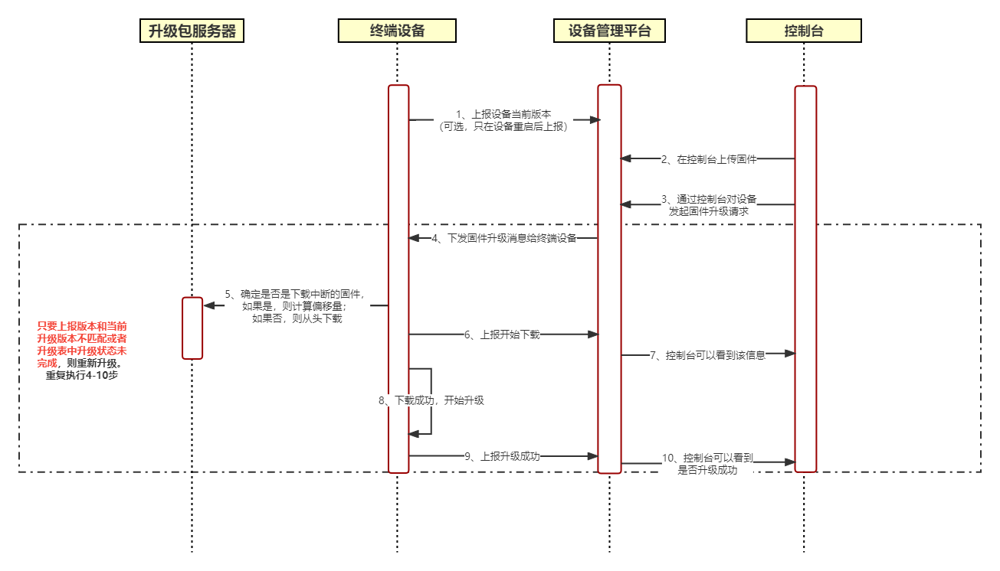

# 设备端升级
设备管理平台支持进行设备升级。

# 操作时序图



# 实现原理

```text
mqtt/Ack/{设备UUID}
用于设备发布消息，设备上报版本号及下载、升级结果到设备管理平台
mqtt/Configure/{设备UUID}
用于设备订阅消息，设备接收设备管理平台的升级消息
```

1. 设备上报当前版本号。设备端通过 MQTT 协议发布一条消息到 Topic `mqtt/Ack/{设备UUID}` ，进行版本号的上报，消息为 json 格式，内容如下：
```json
{
     "Action": "reportVersion",
     "version": "0.1"
}
// Action：消息类型
// version：上报的版本号
```

2. 用户登录 设备管理控制台，进行固件上传，并将指定的设备升级到指定的版本。
3. 触发固件升级操作后，设备端会通过订阅的 Topic `mqtt/Configure/{设备UUID}` 收到固件升级的消息，内容如下：
```json
{
     "Action": "upgradeRequest",
     "MD5Sum": "36eb5951179db14a63****a37a9322a2",
     "DownloadURL": "https://oss-1255858890.aliyun.com/",
     "fileSize": 709482,
     "version": "0.2"
}
// Action：消息类型为 upgradeRequest
// version：升级版本
// DownloadURL：下载固件的url
// MD5Sum：固件的MD5值
// fileSize：固件大小，单位为字节
```

4. 设备在收到固件升级的消息后，根据 URL 下载固件，下载的过程中设备会通过 Topic `mqtt/Ack/{设备UUID}` 不断的上报下载进度，上报的内容如下：
```json
{
     "Action": "reportProgress",
     "progress":{
       "state":"downloading",
       "percent":"10",
       "resultCode":"0",
       "resultMsg":""
     },
     "version": "0.2"
}
// Action：消息类型 reportProgress
// state：状态为正在下载中
// percent：当前下载进度，百分比
```

5. 当设备下载完固件，设备需要通过 Topic `mqtt/Ack/{设备UUID}` 上报一条开始升级的消息，内容如下：
```json
{
     "Action": "reportProgress",
     "progress":{
       "state":"burning",
       "resultCode":"0",
       "resultMsg":""
     },
     "version": "0.2"
}
// Action：消息类型 reportProgress
// state：状态为烧制中
```

6. 设备固件升级完成后，再向 Topic `mqtt/Ack/{设备UUID}` 上报升级成功消息，内容如下：
```json
{
     "Action": "reportProgress",
     "progress":{
        "state":"done",
        "resultCode":"0",
        "resultMsg":""
     },
     "version": "0.2"
}
// Action：消息类型
// state：状态为已完成
```
在下载固件或升级固件的过程中，如果失败，则通过 Topic `mqtt/Ack/{设备UUID}` 上报升级失败消息，内容如下：
```json
{
    "Action": "reportProgress",
    "progress":{
       "state":"fail",
       "resultCode":"-1",
       "resultMsg":"time_out"
    },
    "version": "0.2"
}
// state：状态为失败
// resultCode：错误码，-1：下载超时；-2：文件不存在；-3：签名过期；-4:MD5不匹配；-5：更新固件失败
// resultMsg：错误消息
```

# 要点

## 上报设备版本，可以保证设备升级中途关机问题或者升级成功但消息未达问题，当设备重启后会上报当前版本，如果版本不对，则升级失败，否则升级成功。

## 升级固件断点续传，可以解决弱网环境下载固件总是失败问题。随着重试次数增加，必然会累计下完。
物联网设备会出现在部分场景处于弱网环境，在此场景下连接将会不稳定，固件下载会出现中断的情况。如果每次都从 0 偏移开始下载固件，则在弱网环境有可能一直无法完成全部固件下载，因此固件的断点续传功能特别必要，关于断点续传的具体说明如下。

- 断点续传指从文件上次中断的地方开始重新下载或上传，要实现断点续传的功能，需要设备端记录固件下载的中断位置，同时记录下载固件的 MD5、文件大小、版本信息。
- 设备管理平台针对固件下载中断的场景，设备端报告设备的版本，如果上报的版本号与要升级的目标版本号不一致，则平台会再次下发固件升级消息，设备将获取到要升级的目标固件信息与本地记录的中断的固件信息进行比较，确定为同一固件后，基于断点继续下载。
